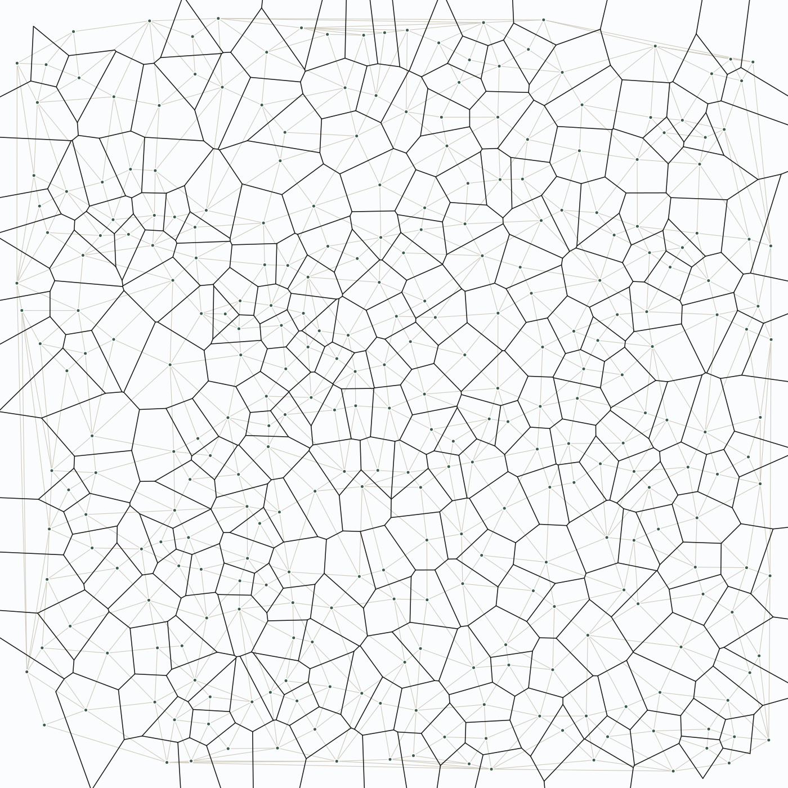
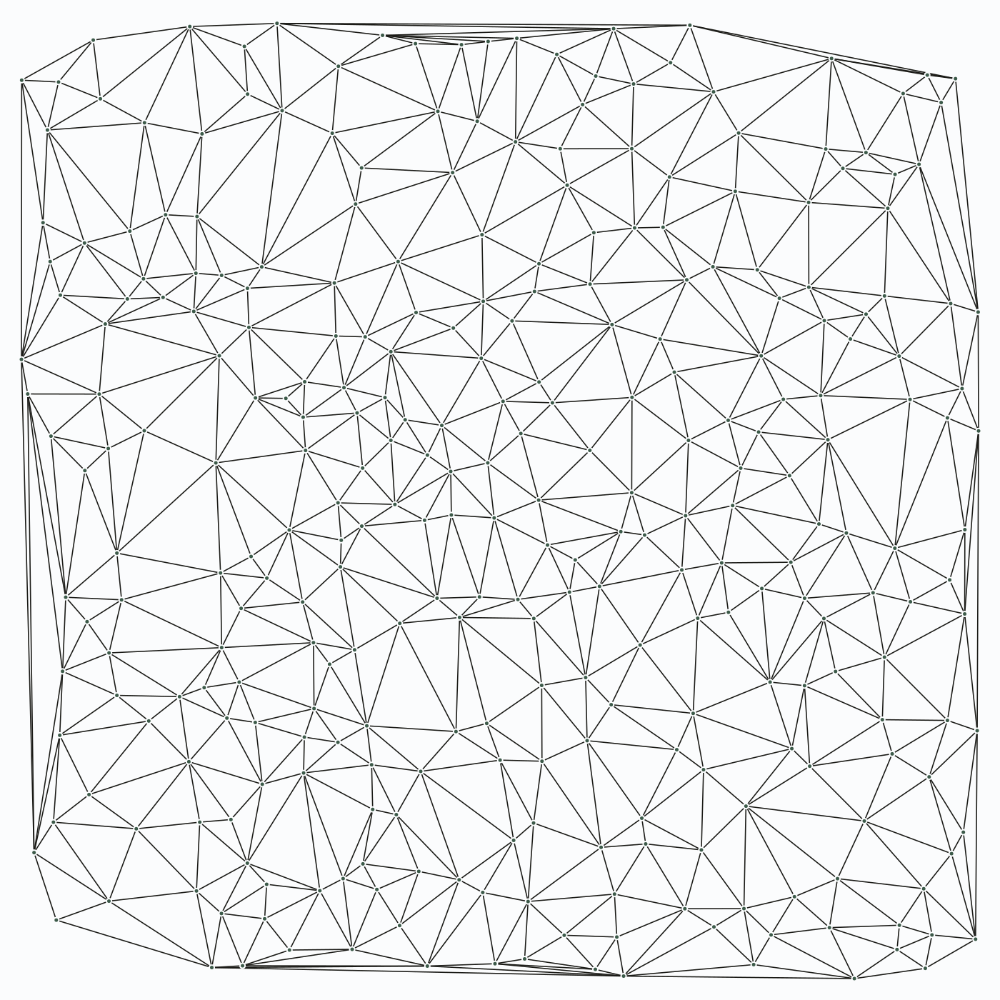
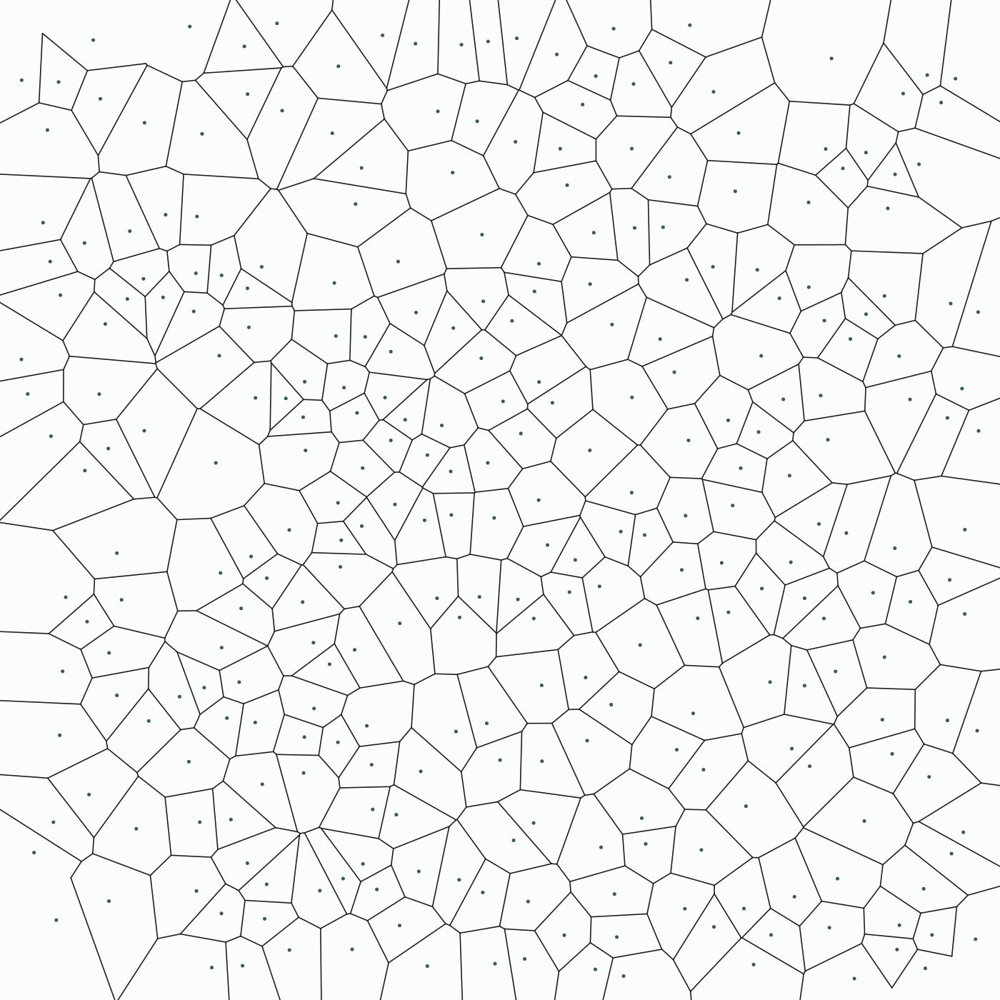

# Planar Geometry Engine

Planar geometry workbench for polygon creation, triangulation, Delaunay/Voronoi generation, and local visualization.



*Delaunay triangulation (faint) with its Voronoi dual (ink) — 300 sites, computed end-to-end by this engine.*

|  |  |
| :---: | :---: |
| *Delaunay triangulation alone.* | *Voronoi diagram alone.* |

## Project Summary

- Main app: `src/main.cc` builds the polygon workflow used by the stable release bundle.
- Demo app: `src/interview_main.cc` builds the guided interview/demo surface.
- Dev-only point-set app: `src/delaunay_driver.cc` drives Delaunay/Voronoi generation and the SVG viewer.
- Dev-only terrain app: `src/terrain_driver.cc` exposes the supported base TIN analysis through a versioned JSON contract.
- Build orchestration lives in `Makefile`; packaged outputs land in `dist/release/` and `dist/interview/`.

## Build And Run

- `make development-normal`: optimized dev build in `build/development/normal/`, including the development-only Delaunay, portfolio-export, benchmark, and terrain drivers.
- `make development-debug`: debug dev build in `build/development/debug/`; same executables, plus `DEBUG` logging support.
- `make release`: internal optimized build in `build/release/`; excludes development-only drivers.
- `make test-suite`: builds and runs 13 core geometry suites plus one independent terrain suite, then exercises the terrain JSON driver.
- `make release-bundle`: packages the stable polygon app into `dist/release/`.
- `make interview-release`: packages the interview/demo app into `dist/interview/` and seeds the Desmos exports.
- `make release-smoke`: rebuilds and validates the stable bundle.
- `make interview-smoke`: rebuilds and validates the interview bundle.
- `make benchmark-smoke`: creates and validates a new immutable benchmark evidence bundle.

Common run paths:

```bash
./build/development/normal/main
./build/development/normal/interview_demo
./build/development/normal/delaunay_driver
./build/development/normal/terrain_driver --format=json --units=metres < points.xyz
./dist/release/run.sh
./dist/interview/run-demo.sh
```

## Repo Structure

- `artifacts/`: Generated artifact output that is useful during local development or experiments but is separate from the packaged release bundles.
- `build/`: Compiler output for the normal development build, debug development build, and internal optimized release build.
- `dist/`: Finished stable and interview/demo bundles, with launchers, copied assets, and bundled browser tooling.
- `docs/`: Supporting documentation for build and packaging behavior, testing and verification flows, viewers, and the full directory map.
- `examples/`: Checked-in sample geometry inputs, mainly used to seed or demonstrate repeatable workflows such as the interview demo.
- `include/`: Public project headers for geometry types, helper APIs, logging, export support, and shared app-facing interfaces.
- `packaging/`: Source launchers and quickstart files that are copied into `dist/` when the stable or interview bundle is assembled.
- `scripts/`: Helper scripts for smoke tests, build metadata generation, and older one-off compilation or utility workflows that are still kept in the repo.
- `src/`: Core C++ implementation files for the CLI apps, geometry algorithms, export logic, and other shared runtime behavior.
- `testing/`: Regression harness code, assertion helpers, legacy fixtures, and the individual suite files that back `make test-suite`.
- `tools/`: Repo-local browser viewers plus the JSON and session artifacts they load for polygon, triangulation, Delaunay, and Voronoi workflows.

For the full nested directory map, see [`docs/repo-structure.md`](docs/repo-structure.md).

## Executables

- `main` (`src/main.cc`): The primary polygon app for day-to-day manual runs, feature work, and the stable release bundle; built in `development-normal`, `development-debug`, and `release`, then packaged as `dist/release/bin/planar-geometry`.
- `interview_demo` (`src/interview_main.cc`): The guided demo app for presentation-safe runs, deterministic sample output, and interview packaging; built in `development-normal`, `development-debug`, and `release`, then packaged as `dist/interview/bin/planar-geometry-demo`.
- `rand_poly_gen_driver` (`src/rand_poly_gen_driver.cc`): A focused driver for iterating on random polygon generation without going through the full main app flow; built in `development-normal`, `development-debug`, and `release`.
- `driver` (`src/driver.cc`): A legacy sandbox binary for quick manual geometry experiments while developing low-level primitives; built in `development-normal`, `development-debug`, and `release`.
- `delaunay_driver` (`src/delaunay_driver.cc`): The development-only point-set app for generating Delaunay/Voronoi artifacts and opening the local SVG viewer; built in `development-normal` and `development-debug`.
- `benchmark_driver` (`src/benchmark_driver.cc`): The development-only deterministic, machine-readable Delaunay/Voronoi benchmark driver; normally invoked through the benchmark Make targets.
- `terrain_driver` (`src/terrain_driver.cc`): The development-only base terrain analyser for TIN construction, slope, balanced-pad earthwork, and MFD accumulation; built in `development-normal` and `development-debug`.
- `tester` (`testing/tester.cc`): The regression runner that executes the geometry test suites behind `make test-suite`; built in `development-normal`, `development-debug`, and `release`.

## Source Files

- `src/benchmark_driver.cc`: Emits deterministic machine-readable Delaunay/Voronoi benchmark observations and embedded build provenance.
- `src/choice.cc`: Prints the menu used by the guided interview/demo app.
- `src/contains_driver.cc`: Small one-off driver for experimenting with triangle containment logic; not wired into `Makefile`.
- `src/create_convex_polygon.cc`: Older helper intended to generate convex polygon input files; useful as historical context, but currently unfinished.
- `src/delaunay.cc`: Implements Delaunay predicates, Bowyer-Watson triangulation, and validation logic for the point-set workflow.
- `src/delaunay_driver.cc`: Entry point for generating Delaunay/Voronoi results, exporting artifacts, and launching the dedicated viewer.
- `src/die.cc`: Implements the fatal invariant-violation helper used when geometry assumptions are broken.
- `src/driver.cc`: Entry point for the legacy geometry sandbox executable.
- `src/ear_clipper.cc`: Standalone prototype for manual ear-clipping runs; not wired into `Makefile`.
- `src/ear_clipping_triangulation.cc`: Implements polygon triangulation through the ear-clipping algorithm used by the polygon workflow.
- `src/helper.cc`: Collects shared input routines, geometry helpers, export writers, and browser-launch support used across the apps.
- `src/interview_main.cc`: Entry point for the guided interview/demo app, including sample-demo and version/about flows.
- `src/line.cc`: Implements the line primitive and the line-intersection logic used by older geometry code.
- `src/main.cc`: Entry point for the primary polygon app used in development and the stable bundle.
- `src/point.cc`: Implements the point primitive and basic point-level geometry operations.
- `src/polygon.cc`: Implements the polygon data model, area logic, triangulation storage, and user-facing formatting.
- `src/polygon_DEBUG.cc`: Older debug-oriented polygon implementation snapshot retained for reference; not part of current builds.
- `src/polygon_app_support.cc`: Implements shared CLI helpers for input handling, export flow, and viewer launching in the app surfaces.
- `src/rand_poly_gen_driver.cc`: Entry point for the random-polygon development driver.
- `src/random_polygon_generator.cc`: Implements the random simple-polygon generator and its validation/retry behavior.
- `src/triangle.cc`: Implements the triangle primitive and derived triangle geometry operations.
- `src/terrain.cc`: Implements validated TIN construction, facet metrics, balanced-pad cut/fill, and MFD accumulation.
- `src/terrain_driver.cc`: Implements the text and versioned JSON command-line contract for supported base terrain analysis.
- `src/voronoi.cc`: Builds finite Voronoi diagrams from Delaunay triangulations and adjacency data.

## Header Files

- `include/build_info.h`: Exposes the build metadata embedded by `Makefile`, so apps can report commit, branch, timestamp, profile, and dirty state.
- `include/choice.h`: Declares the menu-printing helpers used by the guided interview/demo surface.
- `include/delaunay.h`: Defines the indexed Delaunay data structures, geometric predicates, and triangulation API used by the point-set workflow.
- `include/die.h`: Declares the fatal helper used when the code reaches an invalid geometric state.
- `include/ear_clipping_triangulation.h`: Declares the ear-clipping triangulation functions used by polygon code.
- `include/edge.h`: Placeholder header for a future explicit edge abstraction.
- `include/helper.h`: Declares shared input helpers, geometry utilities, and export functions used across the apps and drivers.
- `include/line.h`: Defines the line primitive API used by older geometry code and triangle construction logic.
- `include/logger.h`: Provides runtime-configurable debug-tag parsing and logging helpers, mainly useful in debug builds.
- `include/point.h`: Defines the point primitive and the basic point/vector operations used throughout the repo.
- `include/pointset.h`: Sketches an incomplete point-set type that is not part of the active build surface.
- `include/polygon.h`: Defines the polygon type and the geometry-oriented operations built around it.
- `include/polygon_app_support.h`: Declares the shared app helpers for menu input, export paths, and browser-launch behavior.
- `include/random_polygon_generator.h`: Declares the random polygon generation API used by the main app and dev driver.
- `include/triangle.h`: Defines the triangle primitive and the operations derived from triangle geometry.
- `include/voronoi.h`: Defines the Voronoi data structures and the builder API used by the point-set workflow.
- `include/terrain.h`: Declares terrain validation, TIN metrics, earthwork, and flow APIs with their unit and sampling semantics.

## Shell Scripts

- `scripts/compile_contains_driver.sh`: Legacy one-off compile script for rebuilding `contains_driver` outside the `Makefile`.
- `scripts/compile_driver.sh`: Legacy one-off compile script for rebuilding the sandbox `driver` binary directly.
- `scripts/compile_ear_clipper.sh`: Legacy one-off compile script for rebuilding the standalone `ear_clipper` prototype.
- `scripts/generate_build_info.sh`: Generates `tools/desmos-bridge/build-info.js`, which lets the browser bridge display build provenance.
- `scripts/input_tester.sh`: Legacy helper that feeds canned input through `main` and diffs the result against an expected output file.
- `scripts/interview_smoke.sh`: Validates the packaged interview bundle by checking files, running the sample demo, and verifying exported artifacts.
- `scripts/print_welcome_message.sh`: Decorative helper that prints a stylized welcome banner with external terminal tools.
- `scripts/release_smoke.sh`: Validates the packaged stable bundle by checking files, driving the app, and verifying exported artifacts.
- `scripts/run_cat_test.sh`: Legacy cat-test runner that still references an older repo layout and is mainly useful as historical scaffolding.
- `testing/terrain_driver_smoke.sh`: Verifies the terrain JSON schema, analytic values, error codes, and input-order invariance.
- `packaging/interview/run-demo.sh`: Launcher copied into the interview bundle so the packaged app always runs from the correct bundle root.
- `packaging/release/run.sh`: Launcher copied into the stable bundle so the packaged app resolves its bundled assets correctly.

## Supporting Docs

- [`docs/repo-structure.md`](docs/repo-structure.md): Full nested directory map, organized by each root-level directory in the repo.
- [`docs/build-and-packaging.md`](docs/build-and-packaging.md): Build targets, bundle layouts, provenance flow, and the files involved in packaging.
- [`docs/testing-and-verification.md`](docs/testing-and-verification.md): Regression coverage, smoke-test behavior, manual checks, and debug logging controls.
- [`docs/terrain-analysis.md`](docs/terrain-analysis.md): Supported terrain API and JSON contract, numerical semantics, validation, and evidence limits.
- [`docs/tools-and-viewers.md`](docs/tools-and-viewers.md): The local browser viewers, the artifacts they load, and the fallback flow when auto-launch fails.
- [`docs/benchmarking.md`](docs/benchmarking.md): Reproducible benchmark inputs, metrics, profiles, immutable run bundles, validation, and publication rules.
